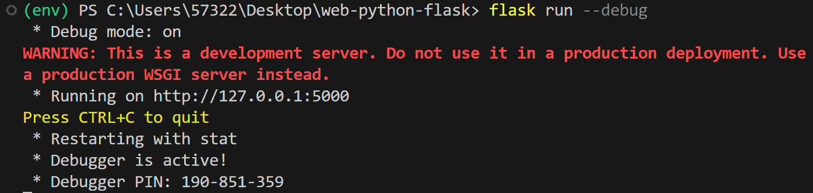
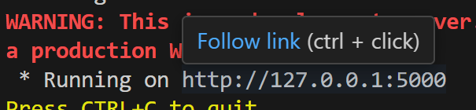
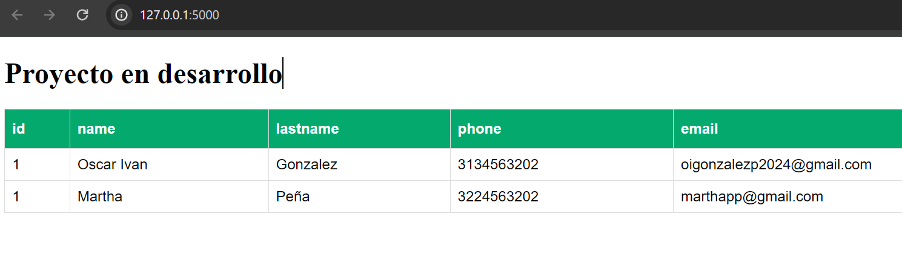

# Web Python Flask

Flask es un marco web de Python que proporciona herramientas y funciones útiles para la creación de aplicaciones web en Python. Flask no fuerza una estructura de directorio concreta ni requiere código estándar complicado antes de iniciarse.

## Empezar desde cero
<pre>
python -m venv env
./env/Scripts/activate
python -m pip install --upgrade pip
pip install flask
pip freeze > requirements.txt
flask run --debug
</pre>

## Cargar un proyecto ya construido
<pre>
python -m venv env
./env/Scripts/activate
python -m pip install --upgrade pip
pip install -r requirements.txt
flask run --debug
</pre>

Una vez configurado te aparece:  

visitas la página en el navegador.  

Te debe aparecer como sigue:  

